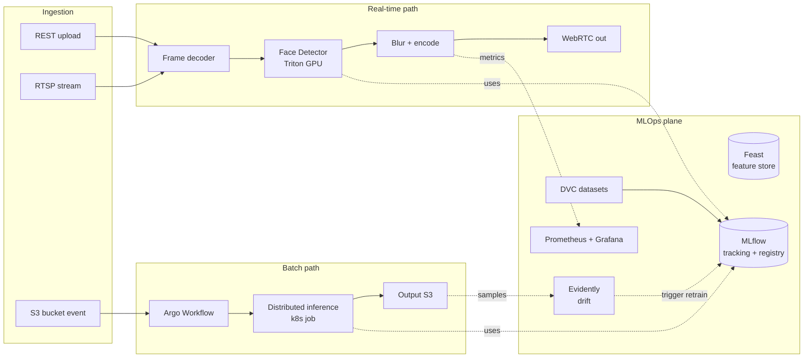

# Архитектура ML-системы для блюра лиц на изображениях/видео

Цель системы: автоматически детектировать лица на входных изображениях/видеопотоках и применять размытие (Gaussian / pixelation) перед публикацией. Используется для соблюдения GDPR/ФЗ-152, для подготовки датасетов и для редактирования контента.

## 1. Слои системы

```
┌──────────────────────────────────────────────────────────────────┐
│  Ingestion Layer (входы)                                         │
│  - REST upload (single image / batch)                            │
│  - RTSP / WebRTC stream (live video)                             │
│  - S3/MinIO bucket events (batch обработка архивов)              │
└──────────────────────────────────────────────────────────────────┘
                              │
                              ▼
┌──────────────────────────────────────────────────────────────────┐
│  Preprocessing                                                   │
│  - Decode (FFmpeg / OpenCV) для видео → frames                   │
│  - Resize / letterbox под input shape детектора                  │
│  - Color space (BGR↔RGB), batching                               │
└──────────────────────────────────────────────────────────────────┘
                              │
                              ▼
┌──────────────────────────────────────────────────────────────────┐
│  Inference (Detection)                                           │
│  - Face detector: YOLOv8-face / RetinaFace / SCRFD               │
│  - Triton Inference Server (GPU pool) или TorchServe             │
│  - Output: bounding boxes + confidence + landmarks               │
└──────────────────────────────────────────────────────────────────┘
                              │
                              ▼
┌──────────────────────────────────────────────────────────────────┐
│  Postprocessing (Blur)                                           │
│  - NMS, фильтр по confidence threshold                           │
│  - Применение Gaussian blur / pixelation по bbox-regions         │
│  - (опц.) трекинг лиц между кадрами для стабильности             │
└──────────────────────────────────────────────────────────────────┘
                              │
                              ▼
┌──────────────────────────────────────────────────────────────────┐
│  Encoding & Output                                               │
│  - Encode обратно в JPEG/PNG/H.264                               │
│  - Возврат в API (sync) или upload в output bucket (async)       │
│  - Audit log: кто запросил, что обработали, сколько лиц найдено  │
└──────────────────────────────────────────────────────────────────┘
```

Сквозные слои:

- **Storage**: S3/MinIO для input/output медиа, PostgreSQL для метаданных задач, Redis для очередей и кэша превью.
- **Orchestration**: Kafka/RabbitMQ для очереди задач (async), k8s для управления компонентами.
- **Monitoring**: Prometheus метрики (faces_detected_total, blur_latency_seconds, gpu_utilization), Grafana dashboards, alerts на drop confidence или рост latency.
- **Auth/RBAC**: API Gateway (Kong/Traefik) с JWT, уровни доступа на endpoint.

## 2. Pipeline обучения детектора

```
WIDER FACE / собственный аннотированный датасет
        │
        ▼  (DVC stage)
Аугментация (Albumentations: rotation, color jitter, occlusion)
        │
        ▼
Fine-tune YOLOv8-face / RetinaFace (PyTorch, GPU node pool)
        │
        ▼  (MLflow tracking)
Eval на holdout: mAP@0.5, recall@small_faces, FPS
        │
        ▼  (gating)
Если метрики ≥ baseline → MLflow Model Registry (Staging)
        │
        ▼
Shadow deploy (10% трафика) + сравнение метрик к prod
        │
        ▼
Канареечный rollout (k8s rolling update + Argo Rollouts)
        │
        ▼
Production
```

Триггеры ретрейна: новые размеченные данные (порог > N samples), drift detection на входных распределениях (evidently), плановый месячный ретрейн.

## 3. Mermaid-диаграмма



## 4. Технологии по слоям

| Слой | Стек |
|---|---|
| API Gateway | Kong / Traefik |
| API Service | FastAPI / Go (если нужен hot path) |
| Decoder | FFmpeg, OpenCV |
| Inference Server | Triton Inference Server (NVIDIA), TorchServe |
| Model | YOLOv8-face, RetinaFace, SCRFD |
| Tracking / Registry | MLflow |
| Feature/dataset versioning | DVC + S3/MinIO |
| Orchestration | Argo Workflows (batch), k8s Deployment + HPA (real-time) |
| Очереди | Kafka / RabbitMQ / Redis Streams |
| Метаданные | PostgreSQL |
| Кэш / online features | Redis |
| Monitoring | Prometheus, Grafana, Loki |
| Drift / Quality | Evidently AI |
| CI/CD | GitHub Actions / Argo CD |

## 5. Deployment strategy

**Real-time (стрим / API):**
- k8s Deployment с GPU node pool, autoscaling по длине очереди и p95 latency.
- Triton с dynamic batching - объединение запросов в batch до 100ms.
- HPA + KEDA на метрику Kafka lag.
- Канареечный rollout через Argo Rollouts: 5% → 25% → 100% с автоматическим rollback на регрессию метрик.

**Batch (архивы видео/изображений):**
- Trigger через S3 ObjectCreated event → Argo Workflow.
- Workflow дробит большой видеофайл на чанки, распределяет по k8s job-ам с GPU, собирает результат.
- Без жестких latency SLO, оптимизация по cost (spot/preemptible).

## 6. SLO и нагрузка (примерные ориентиры)

| Метрика | Целевое значение |
|---|---|
| p95 latency real-time (1 кадр 1080p) | < 100 ms |
| Throughput на 1 GPU T4 | ~30-40 FPS |
| Recall на лица > 30px | ≥ 0.95 |
| Precision (false-positive blur) | ≥ 0.99 |
| Доступность API | 99.9% |
| RPO для job-метаданных | 1 час |

## 7. Безопасность и compliance

- Хранение исходных (необлюренных) кадров - только в encrypted bucket с retention policy.
- Audit log запросов с user_id и hash оригинала.
- Доступ к non-blurred output только через approved-сервис, по ролям.
- Возможность right-to-be-forgotten - удаление по запросу пользователя в SLA.
