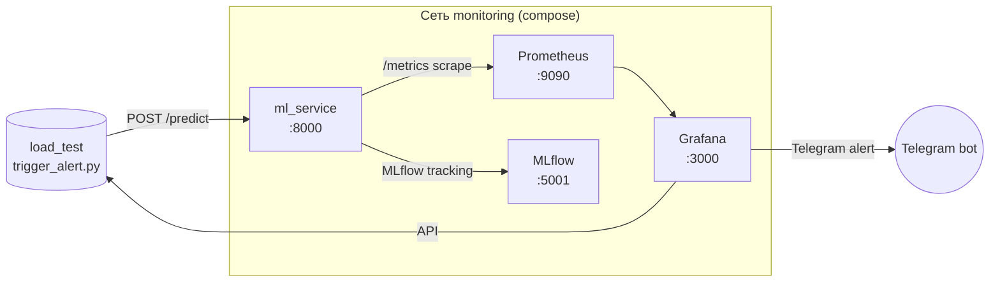

# ML-HW_8: Мониторинг и наблюдаемость ML-системы

Домашнее задание №8 курса МФТИ "Развертывание ML моделей", модуль "Мониторинг и наблюдаемость в продакшене".

Стенд показывает полный observability-цикл для рекомендательной ML-системы онлайн-кинотеатра: SLO -> метрики -> дашборд -> алерт (Telegram) -> дрифт данных и деградация модели (Evidently) -> инцидент качества данных (DQOps на MySQL) -> архитектурное обоснование real-time подмены контента (VPP, Kappa).

## SLO

| Показатель | Порог | PromQL/Источник |
|---|---|---|
| Latency p95 | < 1 сек | `histogram_quantile(0.95, sum(rate(request_latency_seconds_bucket[5m])) by (le))` |
| Error rate | < 1% | `sum(rate(requests_total{status=~"5.."}[5m])) / sum(rate(requests_total[5m]))` |
| Availability | > 99% | `up{job="ml_service"}` за окно 30 дней |

Полное дерево метрик (4 ветви: бизнес / приложение / ML / инфраструктура) - в [`docs/metrics_tree.md`](docs/metrics_tree.md).

## Архитектура стенда



Дополнительный compose `dqops/docker-compose.dqops.yml` поднимает изолированный стек **MySQL 8.4 + DQOps** для Шага 4.

## Quick Start (Windows PowerShell)

```powershell
cd "C:\Python\ML HW\8"

# 1. Подготовить .env (см. секцию Telegram credentials ниже)
Copy-Item .env.example .env
# Открой .env и подставь TG_BOT_TOKEN и TG_CHAT_ID

# 2. Поднять основной стек
docker compose up -d --build
docker compose ps           # 4 сервиса должны быть healthy / running

# 3. Применить Telegram contact point + notification policy через REST API
#    (post-deploy шаг: file-based provisioning не справляется с типизацией chatid)
.\scripts\setup_grafana_telegram.ps1
#    Скрипт сам проверит токен через https://api.telegram.org/bot<TOKEN>/getMe.

# 4. Проверки доступности
curl http://localhost:8000/healthz                          # -> {"status":"ok",...}
curl http://localhost:8000/metrics | Select-String request_latency_seconds_bucket
curl http://localhost:9090/api/v1/targets                   # все targets state="up"
Start-Process http://localhost:3000                         # Grafana, admin / admin
Start-Process http://localhost:5001                         # MLflow UI

# 4. Прогнать нагрузку и поднять алерт
.venv\Scripts\python.exe -m pip install httpx                # один раз
docker compose stop ml_service
$env:LATENCY_MODE = "degraded"
docker compose up -d ml_service
.venv\Scripts\python.exe load_test\trigger_alert.py --mode degraded --workers 20 --requests 500 --probe-grafana-api

# 5. Подождать ~2 минуты (Grafana for: 2m) - alert HighLatencyP95 переходит Pending -> Firing
#    Скрипт сам опросит Grafana Alertmanager API и распечатает state каждого алерта.

# 6. Выключить стек
docker compose down                                         # сохранить volumes
docker compose down -v                                      # полностью очистить
```

## Адреса сервисов

| Сервис | URL | Логин |
|---|---|---|
| ML service | http://localhost:8000 | - |
| Prometheus | http://localhost:9090 | - |
| Grafana | http://localhost:3000 | admin / admin |
| MLflow | http://localhost:5001 | - |
| DQOps (опц.) | http://localhost:8888 | первый запуск - skip Cloud key |

Все теги контейнеров (`PROMETHEUS_TAG`, `GRAFANA_TAG`, `MYSQL_TAG`, `MLFLOW_TAG`, `DQOPS_TAG`) зафиксированы в `.env.example` (проверены на Docker Hub / GHCR 2026-05-16):

- `prom/prometheus:v3.11.3`
- `grafana/grafana:13.0.1`
- `mysql:8.4.9`
- `ghcr.io/mlflow/mlflow:v3.12.0`
- `dqops/dqo:1.10.1` (последний релиз с community-edition; начиная с 1.11 FREE убрали и требуется платный license-ключ)

## Воспроизведение алерта

1. Стек запущен и трафик прошёл хотя бы 5 минут в `normal` режиме (для baseline-окна `[5m]`).
2. Переключение в `degraded`:
   ```powershell
   docker compose stop ml_service
   $env:LATENCY_MODE = "degraded"
   docker compose up -d ml_service
   ```
3. Запуск нагрузки: `python load_test\trigger_alert.py --mode degraded --workers 20 --requests 500 --probe-grafana-api`.
4. В Grafana (`http://localhost:3000/alerting/list`) правило `HighLatencyP95` переходит:
   - `Normal` -> `Pending` (~30 сек после первого окна `5m` с p95 > 1s)
   - `Pending` -> `Firing` (через `for: 2m`)
5. При корректных TG_BOT_TOKEN / TG_CHAT_ID - сообщение в Telegram-чате с темплейтом из `grafana/provisioning/alerting/contact-points.yml`.

Дублирующее правило в `prometheus/alerts.yml` тоже сработает (видно в Prometheus -> Alerts).

## Скриншоты

Папка [`screenshots/`](screenshots/) содержит подтверждающие артефакты прогона стенда:

- Prometheus `/targets` со всеми сервисами UP.
- Дашборд `ML Service - HW8` в Grafana в нормальном режиме и при degraded latency.
- Правило `HighLatencyP95` в состоянии Firing в Grafana Alerting.
- Сообщение от Telegram-бота с алертом.
- Experiment `ml_service_bootstrap` в MLflow с залогированной моделью.
- Сводка отчёта Evidently по дрифту и регрессии.
- Открытый инцидент в DQOps Incidents после `02_break_schema.sql`.

## Шаги задания

### Шаг 1. Дерево метрик

`docs/metrics_tree.md` - четыре ветви (бизнес / приложение / ML / инфраструктура), для каждой метрики: единица, target, владелец, источник сбора. Контекст - онлайн-кинотеатр, пик 10 000 RPS, целевые SLO с обоснованием.

### Шаг 2. Prometheus + Grafana + MLflow + ML-сервис

- `ml_service/app.py` - FastAPI с 5 метриками (`request_latency_seconds`, `requests_total`, `model_predictions_total`, `model_prediction_confidence`, `app_info`), управляемая latency через `LATENCY_MODE`, lazy MLflow bootstrap (логирует `LogisticRegression` baseline при старте).
- `prometheus/` - scrape ml_service + PromQL alerts (HighLatencyP95, HighErrorRate).
- `grafana/` - провижионинг datasource + dashboard (9 панелей) + Telegram contact point + alert rule.
- `docker-compose.yml` - 4 сервиса с healthcheck и `${...}` подстановкой тегов из `.env`.
- `load_test/trigger_alert.py` - asyncio с 20 воркерами + опциональный `--probe-grafana-api` для текстовой проверки firing-состояния.

### Шаг 3. Дрифт данных и деградация модели

- `drift/drift_report.py` (evidently 0.7.21) - синтетический cinema reference batch (5000 строк) vs current batch с тремя дрифтами: `watch_time_min x3`, доля `mobile` 40% -> 75%, новая категория `country=KG`.
- Ridge regressor на reference, RMSE на current выше на ~46% - деградация модели.
- Артефакты: `drift/reports/data_drift_report.html` + `drift/reports/data_drift_summary.json` (регенерируются, не коммитятся).

```powershell
.venv\Scripts\python.exe -m pip install -r drift\requirements.txt
.venv\Scripts\python.exe drift\drift_report.py
Start-Process drift\reports\data_drift_report.html
```

### Шаг 4. Data Quality Ops инцидент

- `dqops/01_init.sql` - эталонная схема `cinema_users`.
- `dqops/seed_data.py` - засев ~1000 строк через `pymysql`.
- `dqops/02_break_schema.sql` - 5-шаговый инцидент: RENAME COLUMN (семантика x60), ENUM extend, MODIFY email NULL, DROP DEFAULT, UPDATE 5% rows = NULL.
- `dqops/docker-compose.dqops.yml` - изолированный стек MySQL 8.4 + DQOps 1.10.1 (community).
- Полный сценарий воспроизведения - в [`dqops/README.md`](dqops/README.md).

### Шаг 5. Архитектура VPP (Kappa)

- `architecture/vpp_architecture.py` - Kappa-топология через `diagrams`: Kafka стримы между ingest, Spark Structured Streaming, YOLO + segmentation, generative inpainting с personalization и brand catalog, output Kafka, re-assembly, edge CDN, observability и feedback loop через A/B + MLflow.
- PNG: [`architecture/vpp_architecture.png`](architecture/vpp_architecture.png).
- ADR обоснование выбора Kappa vs Lambda: [`docs/adr/0001-stream-architecture-for-vpp.md`](docs/adr/0001-stream-architecture-for-vpp.md).
- ADR обоснование стека мониторинга: [`docs/adr/0002-prometheus-grafana-stack-choice.md`](docs/adr/0002-prometheus-grafana-stack-choice.md).

## Получение Telegram credentials

1. В Telegram открыть `@BotFather` -> `/newbot` -> ввести имя -> получить `<bot_token>`. Вставить в `.env` как `TG_BOT_TOKEN`.
2. Написать новому боту любое сообщение (например, `/start`) из своего аккаунта.
3. В браузере открыть `https://api.telegram.org/bot<bot_token>/getUpdates` и найти `chat.id` в JSON-ответе. Вставить в `.env` как `TG_CHAT_ID`.
4. Применить contact point: `.\scripts\setup_grafana_telegram.ps1` (скрипт сам делает `getMe`-проверку токена и через REST API Grafana создаёт/обновляет contact point + notification policy; YAML-провижионинг не справлялся с типизацией `chatid`).
5. Тестовое уведомление: в Grafana UI открыть `Alerting -> Contact points -> telegram-hw8 -> Test`.

## Структура репозитория

```
ML-HW_8/
├── README.md                       # этот файл
├── docker-compose.yml              # ml_service + prometheus + grafana + mlflow
├── .env.example                    # пины тегов образов + плейсхолдеры секретов
├── .gitignore
├── ml_service/                     # FastAPI сервис с метриками и MLflow bootstrap
│   ├── app.py
│   ├── Dockerfile
│   └── requirements.txt
├── prometheus/
│   ├── prometheus.yml
│   └── alerts.yml
├── grafana/
│   ├── provisioning/
│   │   ├── datasources/prometheus.yml
│   │   ├── dashboards/dashboards.yml
│   │   └── alerting/
│   │       └── alert-rules.yml      # contact point создаётся скриптом setup_grafana_telegram.ps1
│   └── dashboards/ml_service_dashboard.json
├── mlflow/mlruns/.gitkeep          # persistent volume mount-point
├── drift/                          # Evidently drift + regression
│   ├── drift_report.py
│   ├── requirements.txt
│   └── reports/.gitkeep            # HTML/JSON генерируются скриптом
├── dqops/
│   ├── README.md
│   ├── docker-compose.dqops.yml
│   ├── 01_init.sql
│   ├── 02_break_schema.sql
│   └── seed_data.py
├── architecture/                   # VPP Kappa diagram
│   ├── requirements.txt
│   ├── vpp_architecture.py
│   └── vpp_architecture.png
├── docs/
│   ├── metrics_tree.md
│   └── adr/
│       ├── 0001-stream-architecture-for-vpp.md
│       └── 0002-prometheus-grafana-stack-choice.md
├── notebook/HW8_Monitoring_Volkhin_Sergei.ipynb
├── screenshots/                    # PNG/PDF подтверждающих кадров
├── load_test/trigger_alert.py
└── scripts/                        # nbformat-патчеры (по одному на шаг)
    ├── step1_enrich_notebook.py
    ├── step2_fill_notebook_cells.py
    ├── step3_enrich_notebook.py
    ├── step4_enrich_notebook.py
    └── step5_enrich_notebook.py
```

## Troubleshooting / зафиксированные шаги smoke-теста

| Шаг | Команда | Ожидаемо |
|---|---|---|
| 1 | `docker compose config` | exit 0, без сообщений об ошибках |
| 2 | `docker compose up -d --build` | 4 контейнера в `running` или `healthy` |
| 3 | `curl http://localhost:8000/healthz` | HTTP 200, JSON `{"status":"ok",...}` |
| 4 | `curl http://localhost:8000/metrics \| Select-String request_latency_seconds` | непустой вывод |
| 5 | `curl http://localhost:9090/api/v1/targets` | все targets `state=up` |
| 6 | `curl http://localhost:5001` | MLflow UI HTML |
| 7 | `Start-Process http://localhost:3000` | дашборд `ML Service - HW8` уже провижионился |
| 8 | `python load_test\trigger_alert.py --mode degraded --probe-grafana-api` | Pending -> Firing, в выводе скрипта - запись об активном алерте |
| 9 | `docker compose down` | контейнеры остановлены |

Если шаг 3 падает: проверь `LATENCY_MODE` (для healthcheck режим `normal` достаточно быстрый), смотри `docker logs ml_service`.
Если шаг 5 показывает `ml_service` в DOWN: pull свежей картинки `prom/prometheus:${PROMETHEUS_TAG}` и проверь сеть `monitoring` через `docker network inspect ml-hw-8_monitoring`.
Если шаг 8 не переходит в Firing: убедись что прошло ≥ 2 минуты с момента сустойного p95 > 1s; проверь `/api/v1/rules` в Prometheus и `/alerting/list` в Grafana.

Если Telegram возвращает 400/404 при тестовом сообщении: запусти `curl https://api.telegram.org/bot<TOKEN>/getMe` - при `ok=false` бери свежий токен у `@BotFather`. После правки `.env` повторно запусти `.\scripts\setup_grafana_telegram.ps1` (он идемпотентный - PUT обновит существующий contact point).

## Автор

Sergei Volkhin (`SergeiVolkhin`) - студент курса МФТИ "Развертывание ML моделей", 2026.

Лицензия: MIT.
